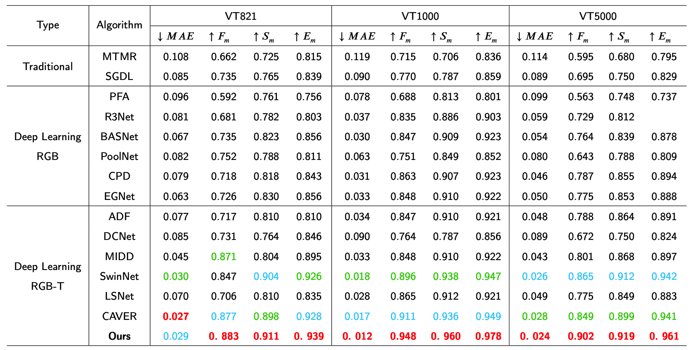

# MSED-Net


## Requirements

- [Python3.8](https://www.python.org/)

- [Pytorch1.8.2 LTS](https://pytorch.org/)

- [Cuda11.1](https://developer.nvidia.com/cuda-toolkit) 

- [OpenCV-Python](https://opencv.org/)

## Datasets

Download the following datasets and unzip them into `dataset` folder

- [VT821](https://arxiv.org/pdf/1701.02829.pdf)
- [VT1000](https://arxiv.org/pdf/1905.06741.pdf)
- [VT5000](https://arxiv.org/pdf/2007.03262.pdf)

## Testing

First, Install the required third-party libraries in the`requirements.txt`

```shell
pip install -r requirement.txt
```

Second, please download the pretrained model into `run/models` folder.

- model: https://pan.baidu.com/s/1Ss5w-vRNQAhiPX1er1mDfQ?pwd=2edr [password: `2edr`]

Third, Test the model and get the predicted saliency maps, which will be saved into `run/maps` folder.

```shell
python test.py
```

## Training

Fixed the related configuration in the `config.py` file，We recommend using the pre-training model we provide for the best training accuracy

```shell
python train.py
```

## Results

- saliency maps: https://pan.baidu.com/s/1MRNDrx-J3gYFZDs_8bFy9g?pwd=suep [password: `suep`] 
- Trained models: https://pan.baidu.com/s/1Ss5w-vRNQAhiPX1er1mDfQ?pwd=2edr [password: `2edr`]


